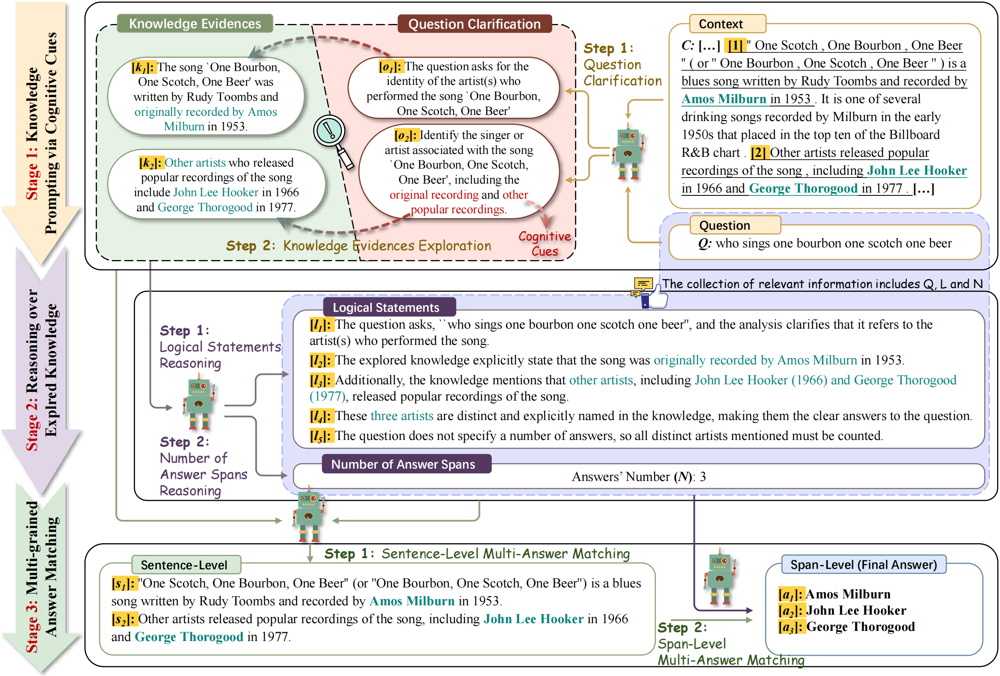

# SIGMA-CoT
We propose SIGMA-CoT, a novel chain-of-thought prompting framework that performs cascaded, multi-grained cognitive matching, effectively eliciting cognitive knowledge-aware reasoning capability of LLMs and simplifying their task adaptation for MSQA. 

### Overview
SIGMA-CoT frames multi-answer extraction as a cognitive matching problem, prompting LLMs to bridge the cognitive gap between the question and its information needs, as well as between the information needs and their fine-grained answers, to effectively perform multi-answer matching. 



An overview of our prompting strategy is presented, consisting of three key stages: Knowledge Prompting via Cognitive Cues, Reasoning over Explored Knowledge, and Multi-grained Answer Matching.

### Prepares
- Pasting your OpenAI key to .env
- Install the required dependencies using the following command:

```angular2html
pip install -r requirements.txt
```

### Using SIGMA-CoT
```angular2html
python run_sigma_cot.py --dataset msqa --model gpt35
```